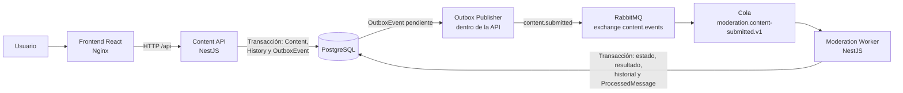

# Content Moderation Queue

Aplicación académica que demuestra moderación asíncrona de contenido mediante una cola de mensajes. Incluye una interfaz web para ejecutar y observar el recorrido completo desde la recepción del contenido hasta la decisión persistida.

## Investigación

**Tema:** Message Queue (cola de mensajes).

El propósito es demostrar comunicación asíncrona y desacoplamiento entre dos servicios desarrollados por el equipo: **Content API** y **Moderation Worker**, ambos implementados con NestJS. RabbitMQ transporta los eventos entre ellos; PostgreSQL conserva el estado y la evidencia del flujo.

El frontend es el cliente de demostración. RabbitMQ y PostgreSQL son infraestructura, no se cuentan como las dos aplicaciones comunicadas.

## Problema que resuelve

Procesar la moderación dentro de la solicitud HTTP acoplaría la API al tiempo de ejecución y a los fallos del moderador. Una operación lenta o temporalmente no disponible afectaría directamente la respuesta al usuario.

La cola permite que la API acepte y persista el contenido, mientras el worker lo modera de forma independiente. El resultado aparece posteriormente mediante consistencia eventual.

## Arquitectura



`api` y `moderation-worker` son los dos servicios de aplicación que participan en la comunicación asíncrona. El publicador Outbox forma parte del proceso de la API, no es un servicio adicional.

## Flujo de comunicación

1. El usuario crea o selecciona un usuario y envía contenido desde el frontend.
2. Content API guarda `Content` con estado `PENDING`, la entrada inicial de `ModerationHistory` y un `OutboxEvent` dentro de una misma transacción PostgreSQL.
3. Outbox Publisher toma el evento pendiente y publica `content.submitted` versión 1 en el exchange `content.events`, con routing key `content.submitted`.
4. El evento contiene `eventId`, `correlationId`, metadatos temporales y el payload `{ contentId }`. RabbitMQ lo dirige a `moderation.content-submitted.v1`.
5. Moderation Worker consume el mensaje con confirmación manual.
6. El worker aplica reglas deterministas y obtiene `APPROVED`, `REVIEW_REQUIRED` o `REJECTED` según el contenido.
7. En una transacción guarda el estado terminal, `ModerationResult`, la transición final de `ModerationHistory` y el marcador `ProcessedMessage`.
8. Tras completar la transacción, el consumidor envía el ACK. Un evento ya registrado para ese consumidor se reconoce como duplicado sin repetir sus efectos.
9. El detalle del contenido consulta periódicamente la API mientras el estado está activo y muestra el resultado final mediante consistencia eventual.

## ¿Por qué RabbitMQ?

RabbitMQ es software libre, se ejecuta fácilmente con Docker y ofrece semántica de colas adecuada para este caso: routing, mensajes persistentes, consumidores con ACK manual y soporte para reintentos y dead-letter queues. Estas características permiten observar claramente el intercambio asíncrono en un entorno educativo.

Alternativas posibles:

- **Apache Kafka:** orientado especialmente a streams durables, logs de eventos y alto rendimiento.
- **NATS:** mensajería ligera con operación y latencia reducidas.

Para este flujo de trabajo basado en una cola de tareas, RabbitMQ permite mostrar los conceptos requeridos con poca infraestructura local.

## Ventajas

- Desacopla la recepción HTTP del procesamiento de moderación.
- Evita bloquear la solicitud mientras se ejecuta trabajo independiente.
- Amortigua ráfagas al conservar mensajes pendientes en la cola.
- Permite reintentos y aislamiento de mensajes fallidos.
- Facilita escalar API y consumidores de manera independiente.

## Desventajas

- Introduce infraestructura y configuración adicionales.
- Requiere aceptar y comunicar consistencia eventual.
- Debe manejar entregas duplicadas mediante idempotencia.
- Añade políticas de reintento, errores y DLQ.
- Hace más compleja la observación y depuración del recorrido distribuido.

## Cuándo usar Message Queue

Es apropiado para trabajo lento o independiente, procesamiento asíncrono, absorción de picos y comunicación entre servicios que no necesitan finalizar dentro de la misma solicitud.

Puede ser innecesario para operaciones simples y síncronas donde la respuesta inmediata, el orden directo y la menor complejidad operativa son más importantes.

## Tecnologías

- **Backend:** NestJS, TypeScript, Prisma y PostgreSQL.
- **Mensajería:** RabbitMQ con `amqplib` y `amqp-connection-manager`.
- **Frontend:** React, TypeScript y Vite.
- **Infraestructura:** Docker, Docker Compose y Nginx.

## Requisitos

- Git.
- Docker.
- Docker Compose.

En Windows se recomienda Docker Desktop. El host no necesita Node.js, pnpm, PostgreSQL ni RabbitMQ.

## Ejecución rápida

En PowerShell:

```powershell
git clone https://github.com/DanielMarchenaMatarrita/Content-moderation-queue.git content-moderation-queue
cd content-moderation-queue
.\run.ps1
```

`run.ps1` verifica Docker y Docker Compose, construye las imágenes, inicia los cinco servicios y espera su disponibilidad. Durante el arranque, la API ejecuta automáticamente las migraciones existentes con `prisma migrate deploy`; no ejecuta un seed.

Servicios de Compose: `postgres`, `rabbitmq`, `api`, `moderation-worker` y `frontend`. Las imágenes de aplicación se construyen desde `backend/Dockerfile` y `frontend/Dockerfile`.

| Recurso | URL |
| --- | --- |
| Frontend | <http://localhost:8080> |
| API | <http://localhost:3000> |
| Swagger | <http://localhost:3000/docs> |
| RabbitMQ Management | <http://localhost:15672> |

Las credenciales de demostración de RabbitMQ son `moderation_dev` / `moderation_dev` y solo están destinadas al entorno local definido por Compose.

## Ejecución manual con Docker Compose

Desde la raíz del repositorio:

```bash
docker compose up --build -d
docker compose ps
```

Para consultar diagnósticos:

```bash
docker compose logs api moderation-worker rabbitmq
```

## Cómo probar el escenario

### Demostración con la interfaz

1. Abra <http://localhost:8080>.
2. Entre a **Users**, seleccione **Create user** y registre correo, nombre y una contraseña de 8 a 128 caracteres.
3. Entre a **Contents**, seleccione **Submit content**, elija el usuario y envíe un texto.
4. En el detalle observe el estado inicial `PENDING` y espere el estado terminal. La decisión depende de las reglas de moderación; puede ser `APPROVED`, `REVIEW_REQUIRED` o `REJECTED`.
5. Revise **Moderation result** y **Moderation timeline**. Deben existir el resultado y las transiciones inicial y final.
6. Abra **System > Outbox events**, localice `content.submitted` por el identificador del contenido y verifique **Published**.
7. Abra **System > Processed messages** y verifique un registro del consumidor `moderation-worker.content-submitted.v1` para el mismo `eventId`.
8. Opcionalmente abra RabbitMQ Management para inspeccionar exchange, colas y consumidor activos.

Este recorrido evidencia persistencia transaccional, publicación Outbox, entrega por RabbitMQ, consumo del worker, idempotencia y consistencia eventual. Una validación Docker-only del proyecto produjo correctamente un caso `APPROVED`, sin implicar que todos los textos reciban esa decisión.

### Alternativa con Swagger

Swagger está disponible en <http://localhost:3000/docs>. Use `POST /users` con los campos `email`, `displayName` y `password`; después use el `id` devuelto en `POST /contents` con los campos `userId` y `body`. Los endpoints `GET /contents/{id}`, `GET /contents/{id}/moderation-results`, `GET /contents/{id}/moderation-history`, `GET /internal/outbox-events` y `GET /internal/processed-messages` permiten comprobar el flujo.

## Evidencia de Message Queue

| Elemento | Evidencia concreta |
| --- | --- |
| Iniciador | Content API al aceptar `POST /contents` |
| Información transmitida | Evento `content.submitted` v1; incluye `eventId`, `correlationId` y `payload.contentId` |
| Transporte | Exchange RabbitMQ `content.events` y cola `moderation.content-submitted.v1` |
| Procesador | Moderation Worker, consumidor `moderation-worker.content-submitted.v1` |
| Resultado observable | Outbox **Published**, `ModerationResult`, historial final, `ProcessedMessage` y estado terminal |

## Confiabilidad

- **Transactional Outbox:** `Content`, historial inicial y `OutboxEvent` se crean en una sola transacción. El publicador marca `publishedAt` después de publicar mediante un canal con confirmación.
- **Consumo idempotente:** la combinación única `(eventId, consumerName)` en `ProcessedMessage` impide repetir los efectos de un evento ya procesado. El marcador y los cambios de moderación se confirman en la misma transacción.
- **ACK manual:** el consumidor usa `noAck: false` y confirma el mensaje después del procesamiento transaccional exitoso o de reconocer un duplicado.
- **Retry y DLQ:** un fallo se republica en `moderation.content-submitted.retry.v1`, espera 5 segundos y vuelve a la cola principal. Después de un máximo de tres reintentos pasa a `moderation.content-submitted.dlq.v1`; mensajes inválidos van directamente a esa DLQ. El mensaje original se confirma después de republicarlo correctamente.

## Estructura relevante

```text
backend/
  apps/api/                    Content API y Outbox Publisher
  apps/moderation-worker/      Consumidor y motor de moderación
  libs/contracts/              Contrato content.submitted
  libs/database/               Acceso Prisma
  libs/messaging/              Conexión y topología RabbitMQ
  prisma/migrations/           Migración inicial
  Dockerfile
frontend/                      Cliente React servido por Nginx
  Dockerfile
  nginx.conf
compose.yaml                   Orquestación completa
run.ps1                        Inicio reproducible en Windows
```

## Detener la aplicación

```bash
docker compose down
```

Para reiniciar también la base de datos y RabbitMQ desde cero:

```bash
docker compose down -v
```

> **Advertencia:** `-v` elimina permanentemente los datos locales guardados en los volúmenes de PostgreSQL y RabbitMQ.
