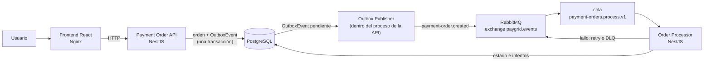

# PayGrid

## Descripción general

PayGrid es un sistema distribuido académico que demuestra procesamiento asíncrono y resiliente de órdenes de pago mediante Message Queue y Retry. **Es una simulación**: no existe integración con bancos ni con pasarelas de pago reales.

El repositorio sigue publicado bajo el nombre histórico `Content-moderation-queue`; el proyecto actual es PayGrid.

## Objetivo

Procesar la orden dentro de la misma solicitud HTTP acopla la aceptación al tiempo de ejecución y a los fallos del procesamiento. PayGrid separa ambas cosas: la API acepta y persiste la orden de forma síncrona, y un servicio independiente la procesa de forma asíncrona mediante RabbitMQ, observando el resultado mediante consistencia eventual.

## Funcionalidades

- Creación de órdenes de pago (`POST /orders`) con escenarios de simulación.
- Procesamiento asíncrono en un servicio independiente (`order-processor`).
- Transactional Outbox: el evento `payment-order.created` se persiste en la misma transacción que la orden.
- Mensajería sobre RabbitMQ con exchange `paygrid.events` y colas dedicadas de proceso, retry y dead-letter.
- ACK manual con entrega *at-least-once* y protección de duplicados (`ProcessedMessage`).
- Retry automático: máximo 3 reintentos con retardo de 5 s.
- Dead Letter Queue `payment-orders.dlq.v1` para mensajes con reintentos agotados o inválidos.
- Historial de procesamiento por orden (`ProcessingAttempt`).
- Escenarios de fallo deterministas: `SUCCESS`, `FAIL_ONCE`, `FAIL_TWICE`, `ALWAYS_FAIL`.
- Dashboard con estadísticas de órdenes y diagrama `System flow`.
- `Processing journey` en el detalle de cada orden.
- Recuperación manual de órdenes fallidas (`POST /payment-orders/:id/reprocess`).
- Ejecución local completa con Docker Compose.

## Tecnologías

- **Backend:** NestJS + TypeScript, Prisma, `amqplib` y `amqp-connection-manager`.
- **Frontend:** React + TypeScript + Vite, TanStack Query.
- **Base de datos:** PostgreSQL 16.
- **Mensajería:** RabbitMQ 4.1 (imagen con management plugin).
- **Infraestructura:** Docker, Docker Compose, Nginx.

## Arquitectura general


```mermaid
flowchart LR
    U["Usuario"] --> F["Frontend React<br/>Nginx"]
    F -->|HTTP| A["Payment Order API<br/>NestJS"]
    A -->|"orden + OutboxEvent<br/>(una transacción)"| DB[(PostgreSQL)]
    DB -->|"OutboxEvent pendiente"| O["Outbox Publisher<br/>(dentro del proceso de la API)"]
    O -->|"payment-order.created"| R["RabbitMQ<br/>exchange paygrid.events"]
    R --> Q["cola<br/>payment-orders.process.v1"]
    Q --> W["Order Processor<br/>NestJS"]
    W -->|"estado e intentos"| DB
    W -->|"fallo: retry o DLQ"| R
```

- `api` y `order-processor` son los dos servicios de aplicación; corren como procesos separados.
- `postgres` y `rabbitmq` son infraestructura, no servicios de aplicación.
- El Outbox Publisher forma parte del proceso de la API; no es un servicio adicional.
- El frontend es el cliente de demostración: solo habla con la API por HTTP, nunca con RabbitMQ.

## Inicio rápido

Requisitos: **Git**, **Docker Engine/Desktop** con **Docker Compose**. El host no necesita Node.js, pnpm, PostgreSQL ni RabbitMQ.

En PowerShell:

```powershell
git clone https://github.com/DanielMarchenaMatarrita/Content-moderation-queue.git
cd Content-moderation-queue
Copy-Item .env.example .env
# Edite .env: defina valores NO vacíos para POSTGRES_PASSWORD y RABBITMQ_PASSWORD
docker compose up -d --build
docker compose ps
```

En Linux/macOS: `cp .env.example .env` en lugar de `Copy-Item`.

`--build` es esencial: construye las imágenes desde el código fuente actual de PayGrid. Sin esa bandera, Compose puede reutilizar imágenes previamente construidas o publicadas que no coinciden con el código fuente.

> Los scripts `run.ps1` y `deploy.sh` realizan `docker compose pull` y `up --no-build`: descargan imágenes publicadas y no construyen el código local. No se usan como flujo de incorporación.

## Accesos locales

| Recurso | URL |
| --- | --- |
| Frontend | <http://localhost:8080> |
| API | <http://localhost:3000> |
| Swagger | <http://localhost:3000/docs> |
| RabbitMQ Management | <http://localhost:15672> |

RabbitMQ Management queda publicado solo en `127.0.0.1`; el puerto puede cambiarse con `RABBITMQ_MANAGEMENT_PORT` en `.env`. Las credenciales provienen de `.env` (`RABBITMQ_USER`, por defecto `paygrid`, y `RABBITMQ_PASSWORD`).

## Escenarios de prueba

| Escenario | Secuencia de intentos | Resultado final |
| --- | --- | --- |
| `SUCCESS` | Intento inicial `SUCCESS` | `SUCCESS`, `retryCount` 0 |
| `FAIL_ONCE` | `ERROR` → Retry 1 `SUCCESS` | `SUCCESS`, `retryCount` 1 |
| `FAIL_TWICE` | `ERROR` → Retry 1 `ERROR` → Retry 2 `SUCCESS` | `SUCCESS`, `retryCount` 2 |
| `ALWAYS_FAIL` | 4 × `ERROR` | `FAILED`, `retryCount` 3 |

Límite de reintento: **3 reintentos**, es decir intento inicial + Retry 1 + Retry 2 + Retry 3 = **4 intentos máximo** por ciclo agotado. El retardo entre reintentos es de 5 s.

## Recuperación manual

Una orden en `FAILED` puede recuperarse con `POST /payment-orders/:id/reprocess` (en la interfaz, el botón **Reprocess order**). La recuperación:

- realiza una transición explícita `FAILED` → `PENDING`;
- crea un **nuevo** evento Outbox y reutiliza el mismo pipeline de procesamiento;
- registra un nuevo intento (por ejemplo, el intento 5 tras un `ALWAYS_FAIL` original);
- conserva el historial de intentos originales y el campo `simulationScenario` original; el escenario aplicado se guarda en `reprocessScenario`;
- **no** es un retry automático y **no** reproduce (replay) el mensaje de la DLQ: el mensaje original permanece intacto en la cola de dead-letter.

## Estado del proyecto

**IMPLEMENTADO**

- Backend y frontend de PayGrid funcionales.
- RabbitMQ con retry (máx. 3) y Dead Letter Queue.
- Transactional Outbox con publicación confirmada.
- Historial de procesamiento (`ProcessingAttempt`) y estadísticas.
- Recuperación manual de órdenes fallidas.
- Ejecución local con Docker Compose.

**PENDIENTE**

- Publicación final de las imágenes en Docker Hub.
- Despliegue remoto público.
- Verificación de un despliegue en producción.

## Documentación

- [Arquitectura de PayGrid](docs/architecture.md) — componentes, topología RabbitMQ, outbox, retry/DLQ, idempotencia, recuperación manual y modelo de persistencia.
- [Guía de desarrollo y ejecución local](docs/development.md) — requisitos, arranque, migraciones, demo paso a paso, solución de problemas y referencia de la API.
