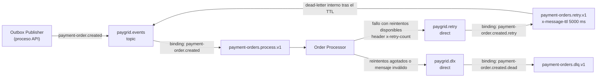

# Arquitectura de PayGrid

PayGrid es el proyecto actual de este repositorio: un sistema distribuido académico que simula el procesamiento asíncrono de órdenes de pago. Content Moderation Queue es la iteración histórica que lo precedió; sus estructuras se conservan en el código y en el esquema de base de datos, pero no forman parte del flujo activo de PayGrid.

Este documento describe primero la arquitectura implementada (5.1–5.15) y después los conceptos de sistemas distribuidos que el proyecto demuestra.

## 5.1 Panorama arquitectónico

PayGrid separa la **aceptación** de una orden de pago de su **ejecución**:

- La solicitud HTTP es corta: valida, persiste la orden y registra un evento, luego responde.
- El procesamiento ocurre después, en otro proceso, sobre mensajes entregados por RabbitMQ.
- El cliente observa el resultado más tarde mediante consistencia eventual (sondeo de la API).

Esto produce desacoplamiento temporal (el emisor no espera al consumidor), desacopamiento espacial (procesos independientes, escalables por separado) y tolerancia a indisponibilidades temporales del consumidor (los mensajes esperan en la cola).

### Clasificación de componentes

| Componente | Clasificación | Proceso |
| --- | --- | --- |
| Payment Order API (`api`) | Servicio de aplicación | NestJS, expone HTTP y contiene el Outbox Publisher |
| Order Processor (`order-processor`) | Servicio de aplicación | NestJS, consume y procesa eventos, sin servidor HTTP |
| Frontend (`frontend`) | Cliente de demostración | React servido por Nginx |
| PostgreSQL (`postgres`) | Infraestructura | Persistencia y evidencia |
| RabbitMQ (`rabbitmq`) | Infraestructura | Enrutamiento, retardo de retry y aislamiento en DLQ |

Comunicación síncrona: cliente → API por HTTP. Comunicación asíncrona: API → Order Processor por eventos sobre RabbitMQ. El frontend no interactúa con RabbitMQ.

## 5.2 Componentes y responsabilidades

| Componente | Responsabilidades |
| --- | --- |
| **Frontend** | Crear órdenes, listar y filtrar estados, mostrar estadísticas del dashboard, mostrar `Processing journey` y `System flow`, ejecutar la acción de recuperación manual (`Reprocess order`), sondear la API mientras la orden está `PENDING` (1,5 s) |
| **Payment Order API** | Validar entradas, persistir `PaymentOrder` + `OutboxEvent` en una transacción, exponer endpoints de consulta (`/orders`, `/orders/stats`, `/orders/:id`, `/orders/:id/attempts`), exponer la recuperación explícita (`POST /payment-orders/:id/reprocess`), servir Swagger en `/docs` |
| **PostgreSQL** | Modelos `PaymentOrder`, `ProcessingAttempt`, `OutboxEvent` y `ProcessedMessage` (más los modelos históricos de Content Moderation Queue, ver 5.11) |
| **Outbox Publisher** | Ciclo propio dentro del proceso de la API: reclama eventos `publishedAt IS NULL` con `FOR UPDATE SKIP LOCKED`, los publica en RabbitMQ mediante canal con confirmación y marca `publishedAt`; reintenta con backoff exponencial ante fallos de publicación. Desacopla la aceptación HTTP de la disponibilidad del broker |
| **RabbitMQ** | Enruta `payment-order.created` hacia la cola principal, retiene mensajes mientras no hay consumidor disponible, aplica el retardo de 5 s del retry y aislamiento de mensajes agotados en la DLQ |
| **Order Processor** | Consume con ACK manual (prefetch 10), valida el sobre del evento, aplica el escenario determinista, persiste `ProcessingAttempt` y el estado de la orden, registra `ProcessedMessage` en el éxito, y enruta el fallo a retry o dead-letter |

## 5.3 Topología RabbitMQ

Identificadores implementados (fuente: `backend/libs/messaging/src/rabbitmq/rabbitmq.constants.ts` y `backend/libs/messaging/src/rabbitmq/paygrid-topology.service.ts`):

| Elemento | Valor exacto |
| --- | --- |
| Exchange principal | `paygrid.events`, tipo `topic` |
| Routing key de evento | `payment-order.created` |
| Cola principal | `payment-orders.process.v1` (bind a `paygrid.events` con `payment-order.created`) |
| Exchange de retry | `paygrid.retry`, tipo `direct` |
| Routing key de retry | `payment-order.created.retry` |
| Cola de retry | `payment-orders.retry.v1` |
| Retardo de retry | 5000 ms (`x-message-ttl` en la cola) |
| Dead-letter de la cola de retry | `x-dead-letter-exchange: paygrid.events`, `x-dead-letter-routing-key: payment-order.created` |
| Dead Letter Exchange | `paygrid.dlx`, tipo `direct` |
| Routing key de dead-letter | `payment-order.created.dead` |
| Dead Letter Queue | `payment-orders.dlq.v1` |
| Header de reintentos | `x-retry-count` |
| Máximo de reintentos | 3 |

### Encaminamiento

1. El Outbox Publisher publica en `paygrid.events` con routing key `payment-order.created`; el binding de la cola principal recibe el mensaje.
2. Ante un fallo con reintentos disponibles, el Order Processor republica en `paygrid.retry` con routing key `payment-order.created.retry` y header `x-retry-count` incrementado; el binding entrega el mensaje a `payment-orders.retry.v1`.
3. `payment-orders.retry.v1` retiene el mensaje 5000 ms y lo devuelve, vía dead-letter interno, a `paygrid.events` con la routing key original: el mensaje vuelve a la cola principal.
4. Cuando los reintentos se agotan (o el mensaje es inválido), el Order Processor publica en `paygrid.dlx` con routing key `payment-order.created.dead`; el binding entrega el mensaje a `payment-orders.dlq.v1`.

Todos los exchanges y colas se declaran como durables. El enrutamiento de retry y dead-letter lo declara el propio Order Processor en su canal de fallo; la cola principal y sus bindings también los declara el Outbox Publisher de la API, de modo que cualquiera de los dos servicios puede arrancar primero.

## 5.4 Recorrido end-to-end del mensaje

Pasos implementados; `[P]` marca evidencia persistida en PostgreSQL, `[I]` marca información explicativa o transitoria y `[P→I]` marca la observación por el cliente de datos persistidos.

1. `[I]` El cliente envía `POST /orders` (desde el frontend o desde Swagger).
2. `[I]` La API valida la entrada: `amount` entero ≥ 1, `currency` con formato `^[A-Z]{3}$`, `simulationScenario` dentro del enum.
3. `[P]` Se crea la `PaymentOrder` con estado `PENDING` y `retryCount` 0.
4. `[P]` En la **misma transacción** se crea el `OutboxEvent` (`eventType` `payment-order.created`, `payload` `{ orderId }`).
5. `[P]` Commit de la transacción: orden y evento quedan atómicos; aún no hay mensaje en el broker.
6. `[P→I]` El Outbox Publisher (dentro del proceso de la API) reclama eventos pendientes y los publica en `paygrid.events` con routing key `payment-order.created` por un canal con confirmación; después marca `publishedAt`.
7. `[I]` RabbitMQ enruta el mensaje a `payment-orders.process.v1`.
8. `[I]` El Order Processor consume con ACK manual (prefetch 10) y valida el sobre (`eventId`, `eventType`, `correlationId`, `payload.orderId`, metadatos AMQP coherentes).
9. `[I]` Ejecución determinista: se resuelve el escenario (`reprocessScenario ?? simulationScenario`) y se decide éxito o error para el `retryCount` actual.
10. `[P]` Se persiste el `ProcessingAttempt` (`attemptNumber`, `status` `SUCCESS`/`ERROR`, `errorDescription`) en la misma transacción que el estado de la orden.
11. `[P]` Se actualiza la `PaymentOrder` (`status`, `retryCount`, `lastError`); en éxito también se crea `ProcessedMessage`.
12. `[I]` Tras confirmar la transacción: si hubo éxito se envía ACK; si hubo fallo se republica en retry (con `x-retry-count` + 1) o, agotado, en la DLQ, y recién entonces se hace ACK del mensaje original.
13. `[P→I]` El frontend sondea `GET /orders/:id` (cada 1,5 s mientras `status` sea `PENDING`) y observa el resultado eventual junto con los intentos persistidos.

## 5.5 Transactional Outbox

El problema de *dual write*: si la API escribiera en PostgreSQL y publicara en RabbitMQ como dos operaciones independientes, un fallo entre ambas deja la base de datos y el broker inconsistentes (orden sin evento, o evento sin orden).

La solución implementada:

- `PaymentOrder` y `OutboxEvent` se crean en **una sola transacción** PostgreSQL (`payment-orders.service.ts`).
- Ninguna de las dos escrituras es visible sin la otra: no hay estado intermedio.
- El Outbox Publisher publica después, de forma independiente, y recién entonces marca `publishedAt`.

Límites de fiabilidad:

- **No existe una transacción distribuida global** entre PostgreSQL y RabbitMQ. El commit local y la publicación en el broker son operaciones separadas.
- La publicación es *eventual*: entre el commit y la entrega al exchange hay una ventana (el ciclo de sondeo del publisher es de 1 s).
- Si la publicación falla, el evento permanece pendiente y se reintenta con backoff exponencial (base 5 s, tope 300 s); `lastError` y `nextAttemptAt` quedan como evidencia.
- La recuperación de eventos pendientes usa `FOR UPDATE SKIP LOCKED` con reclamo (`claimedAt`/`claimedBy`, TTL de 60 s), por lo que el mecanismo de reclamación reduce la publicación concurrente duplicada, pero una caída entre publicar y registrar publishedAt todavía puede provocar una republicación. Esto es compatible con la semántica at-least-once.

## 5.6 Semántica de ACK y entrega

- El consumidor usa `noAck: false` (ACK manual) y confirma el mensaje **después** de cerrar la transacción de persistencia o de reconocer un duplicado.
- RabbitMQ no entrega *exactly-once*: la semántica real es **at-least-once**. Si el proceso muere después de persistir pero antes del ACK, o si el ACK se pierde, el mensaje se vuelve a entregar.
- La protección de duplicados es a nivel de aplicación: `ProcessedMessage` con clave única `(eventId, consumerName)` y las guardas adicionales descritas en 5.9.
- Ante un fallo de procesamiento, el consumidor **publica primero** en retry o DLQ y **después** hace ACK del mensaje original (`payment-order-created-runtime-consumer.service.ts`). Si la publicación falla, el mensaje original no se confirma y volverá a entregarse.
- No se afirma entrega *exactly-once* en ningún punto del sistema.

## 5.7 Estrategia de retry

La semántica del header `x-retry-count`: el valor se lee al recibir el mensaje (0 si no existe) y se incrementa **solo** al republicarlo hacia la cola de retry (`publishRetry(message, retryCount + 1)`). El envío a DLQ ocurre cuando un fallo llega con `retryCount >= 3`, es decir, después de que falla el intento del Retry 3.

Secuencias deterministas (fuente: `deterministicError` en `payment-order-processor.service.ts`):

| Escenario | Intento inicial | Retry 1 | Retry 2 | Retry 3 | Estado final | `retryCount` final |
| --- | --- | --- | --- | --- | --- | --- |
| `SUCCESS` | `SUCCESS` | — | — | — | `SUCCESS` | 0 |
| `FAIL_ONCE` | `ERROR` | `SUCCESS` | — | — | `SUCCESS` | 1 |
| `FAIL_TWICE` | `ERROR` | `ERROR` | `SUCCESS` | — | `SUCCESS` | 2 |
| `ALWAYS_FAIL` | `ERROR` | `ERROR` | `ERROR` | `ERROR` | `FAILED` | 3 |

Aclaraciones verificadas contra el código:

- **3 reintentos ≠ 3 intentos totales.** Son intento inicial + 3 reintentos = **4 ejecuciones máximo** por ciclo agotado.
- `retryCount` persistido en la orden es el número de reintentos consumidos: se incrementa con cada fallo no terminal y se congela en 3 cuando el ciclo se agota.
- El retardo entre intentos es de 5 s, aplicado por TTL en `payment-orders.retry.v1`, no por un temporizador de la aplicación.
- En el ciclo original, los `ProcessingAttempt` se registran por `attemptNumber` (upsert); en un ciclo de recuperación se crean intentos nuevos con numeración continuada (ver 5.10).
- El reintento es automático y limitado; superado el límite, la orden queda en `FAILED` y el mensaje se aísla en la DLQ. La recuperación posterior es un proceso distinto (5.10).

## 5.8 Dead Letter Queue

- **Cuándo recibe mensajes:** cuando un fallo llega con `x-retry-count >= 3` (reintentos agotados) o cuando el sobre del mensaje es inválido (`status: 'invalid'`: JSON incorrecto, envelope inválido o metadatos AMQP incoherentes), que va directo a DLQ sin pasar por retry.
- **Destino:** exchange `paygrid.dlx` (`direct`) con routing key `payment-order.created.dead` → cola `payment-orders.dlq.v1`.
- **Metadatos de fallo:** el header `x-failure-reason` (sanitizado, máximo 256 caracteres, con URLs y credenciales redactadas) y `x-original-queue`; se conservan además `messageId`, `correlationId` y `type` del mensaje original.
- **Diagnóstico:** la cola se inspecciona desde RabbitMQ Management. La UI de PayGrid explica el flujo de dead-letter de forma conceptual y declara explícitamente que no confirma eventos ni marcas de tiempo del broker.
- **Alcance:** la aplicación **no** consume ni reproduce (replay) la DLQ. Tras una recuperación manual a nivel de orden, el mensaje original puede permanecer en la DLQ; no se elimina ni se reencamina.
- **No hay telemetría persistida de llegada a DLQ:** la base de datos no guarda cuándo ni por qué un mensaje llegó a la DLQ, solo el estado `FAILED` de la orden y el último error.

## 5.9 Idempotencia

| Mecanismo | Restricción exacta | Fuente |
| --- | --- | --- |
| `ProcessedMessage` | `@@unique([eventId, consumerName])` | `schema.prisma` |
| Consumidor PayGrid | `consumerName = "order-processor.payment-order.created.v1"` | `payment-order-created.constants.ts` |
| Intentos por orden | `@@unique([orderId, attemptNumber])` | `schema.prisma` |

Comportamiento:

- El marcador `ProcessedMessage` se crea **solo en el éxito**, dentro de la misma transacción que el intento y el estado de la orden. Un evento ya registrado para ese consumidor se reconoce como duplicado y se hace ACK sin repetir efectos (P2002 sobre `eventId` → `duplicate`).
- Los fallos no crean marcador; su re-ejecución es inocua porque la lógica es determinista y los intentos se upsertean por `(orderId, attemptNumber)`.
- Un evento duplicado **no** genera una recuperación nueva: la recuperación depende de la transición de estado `FAILED` → `PENDING` en la API, no del mensaje.
- La recuperación genera **nueva identidad de evento** (`eventId` y `correlationId` nuevos con `randomUUID()`), de modo que su `ProcessedMessage` no colisiona con el del evento original: el ciclo de recuperación puede registrar su propio éxito sin invalidar la evidencia del ciclo anterior.
- Guarda adicional en ciclo de recuperación: si `order.retryCount` no coincide con el `x-retry-count` del mensaje, el mensaje se trata como duplicado y se hace ACK sin efectos (mensajes rezagados de un ciclo previo).

## 5.10 Recuperación manual

Ejemplo verificado contra el código (`ALWAYS_FAIL` original):

1. Orden creada con `simulationScenario: ALWAYS_FAIL` → 4 intentos `ERROR` (attemptNumber 1–4) → estado `FAILED`, `retryCount` 3. Los tres primeros fallos circularon por la cola de retry; el mensaje del cuarto fallo quedó aislado en la DLQ.
2. Se envía `POST /payment-orders/:id/reprocess` con body `{"scenario": "SUCCESS"}`.
3. En una transacción: la orden pasa `FAILED` → `PENDING`, se guarda `reprocessScenario: SUCCESS`, `retryCount` se reinicia a 0 y `lastError` se limpia; además se crea un `OutboxEvent` **nuevo** con `eventType` `payment-order.created`.
4. El Outbox Publisher publica el evento nuevo y el pipeline principal (cola `payment-orders.process.v1`) lo procesa igual que cualquier orden.
5. El intento 5 se ejecuta con `SUCCESS` → estado `SUCCESS`. Quedan evidenciados `simulationScenario: ALWAYS_FAIL` (original, intacto) y `reprocessScenario: SUCCESS` (recuperación, persistido explícitamente).

Propiedades de la recuperación:

- **Transición de estado explícita:** el `updateMany` exige `status: FAILED`; si la orden no está en `FAILED` responde `409 Conflict` (o `404` si no existe).
- **Nuevo evento, mismo pipeline:** no hay código de replay ni de reencaminamiento desde la DLQ; se reutiliza el flujo normal de Outbox → RabbitMQ → Order Processor.
- **Historial preservado:** los intentos 1–4 permanecen; en ciclo de recuperación los intentos se **crean** (no se actualizan) con numeración continuada a partir del último intento registrado (4 → 5).
- **`retryCount` del ciclo actual:** se reinicia a 0 con la recuperación y vuelve a contarse desde cero para el nuevo ciclo.
- **DLQ intacta:** el mensaje original permanece en `payment-orders.dlq.v1`; la recuperación no lo toca.
- **Etiquetas de interfaz:** el botón dice **Reprocess order** y las etiquetas derivadas son **Manual reprocess** / **Manual reprocess recorded** / **Recovered by manual reprocess**. No existe una etiqueta "Retry 4": la recuperación no es el reintento 4.
- La interfaz envía siempre `scenario: "SUCCESS"`; la API acepta cualquier valor del enum `SimulationScenario`.

## 5.11 Modelo de persistencia

Modelos activos de PayGrid (`backend/prisma/schema.prisma`):

| Modelo | Campos clave | Restricciones y relaciones |
| --- | --- | --- |
| `PaymentOrder` | `amount` (Int), `currency` (VarChar 3), `status` (`PaymentOrderStatus`), `simulationScenario`, `reprocessScenario` (nullable), `retryCount`, `lastError` | Índice `@@index([status, createdAt(sort: Desc)])`; relación `attempts` 1‑N con `ProcessingAttempt` |
| `ProcessingAttempt` | `orderId`, `attemptNumber`, `status` (`SUCCESS`\|`ERROR`), `errorDescription`, `createdAt` | `@@unique([orderId, attemptNumber])`, `@@index([orderId, attemptNumber])`; FK con `onDelete: Restrict` |
| `OutboxEvent` | `eventId` (unique), `eventType`, `eventVersion`, `aggregateType`, `aggregateId`, `payload` (Json), `correlationId`, `occurredAt`, `publishedAt`, `claimedAt`, `claimedBy`, `retryCount`, `nextAttemptAt`, `lastError` | Índice `@@index([publishedAt, nextAttemptAt, createdAt(sort: Asc)])` para el sondeo del publisher |
| `ProcessedMessage` | `eventId`, `consumerName`, `processedAt` | `@@unique([eventId, consumerName])` |

Enums relevantes: `PaymentOrderStatus` (`PENDING`, `PROCESSING`, `SUCCESS`, `FAILED`), `SimulationScenario` (`SUCCESS`, `FAIL_ONCE`, `FAIL_TWICE`, `ALWAYS_FAIL`), `ProcessingAttemptStatus` (`SUCCESS`, `ERROR`).

Nota de verificación: el valor `PROCESSING` de `PaymentOrderStatus` está definido en el enum pero el código actual nunca lo persiste; los estados que llegan a la base de datos son `PENDING`, `SUCCESS` y `FAILED`.

### Estructuras históricas retenidas

El esquema conserva los modelos de la iteración anterior Content Moderation Queue: `User`, `Content`, `ModerationResult` y `ModerationHistory`. El API también mantiene registrados sus rutas históricas (`/contents`, `/users`, `/internal/outbox-events`, `/internal/processed-messages` y las rutas de lectura de moderación), y existe `backend/apps/moderation-worker` como aplicación histórica. **No son entidades activas de PayGrid:** Compose no despliega ningún servicio de moderación y el frontend actual no enruta esas páginas. Se documentan solo para explicar por qué permanecen en el repositorio.

## 5.12 Observabilidad

Tres niveles distintos:

| Nivel | Contenido | Ejemplos |
| --- | --- | --- |
| **PERSISTED** | Escrito en PostgreSQL por los servicios | estado de la orden, `retryCount`, `ProcessingAttempt` (número, estado, error, timestamp), `lastError`, `OutboxEvent.publishedAt`, `ProcessedMessage` |
| **DERIVED** | Calculado en el frontend a partir de lo persistido | etiquetas del `Processing journey` (`Initial attempt`, `Retry 1`…, `Manual reprocess`), resúmenes de recuperación (`Recovered by manual reprocess`), resumen de agotamiento (`Retry limit exhausted after 3 retries`), estadísticas del dashboard |
| **EXPLANATORY** | Contenido conceptual, sin telemetría en vivo | diagrama `System flow` del dashboard, explicación del flujo de dead-letter en el detalle de orden (marca "Explanatory only") |

Límites explícitos: el frontend **no** tiene telemetría de nivel broker. No se implementan ni se muestran: profundidad de colas, salud de consumidores, métricas del broker, *consumer lag*, eventos ACK/NACK observados, ni marcas de tiempo de llegada a DLQ. El único sondeo en vivo es el de la API de órdenes (estado e intentos persistidos) mientras la orden está `PENDING`.

## 5.13 Escenarios de falla

| Escenario | Comportamiento implementado | Límite |
| --- | --- | --- |
| API o PostgreSQL no disponibles | No se aceptan órdenes; no hay escrituras parciales (todo es transaccional) | Indisponibilidad total del punto de aceptación |
| RabbitMQ no disponible | La orden y el evento **sí** se persisten; el Outbox Publisher reintenta con backoff hasta que el broker vuelve | Ventana de eventual publicación: la orden queda `PENDING` hasta que el mensaje salga |
| Order Processor no disponible | Los mensajes esperan en `payment-orders.process.v1` (cola durable) | El frontend seguirá mostrando `PENDING` |
| Fallo de procesamiento temporal | Retry automático con retardo de 5 s, máx. 3 reintentos | Determinista por diseño (escenarios de simulación) |
| Reintentos agotados | Orden en `FAILED` con intentos registrados y mensaje publicado en la DLQ | La orden requiere intervención manual para recuperarse |
| Entrega duplicada | `ProcessedMessage` + guardas de intento/reintento → `duplicate` sin efectos nuevos | Requiere que el escenario no avance indebidamente; cubierto en 5.9 |
| Publicación parcial hacia la DLQ | Se publica **antes** del ACK: si la publicación falla, el mensaje original no se confirma y se vuelve a entregar | Frontera no atómica (ver abajo) |

**Frontera no atómica identificada:** el estado `FAILED` de la orden se persiste en una transacción PostgreSQL y la publicación del mensaje en la DLQ es una operación posterior e independiente sobre RabbitMQ. No hay transacción global entre ambas. Un fallo en ese intervalo deja la orden `FAILED` con el mensaje aún en la cola principal (que se reentrega); el sistema converge al reintentar la publicación, pero no de forma atómica. Del mismo modo, la DLQ no registra su llegada en la base de datos.

No se afirma confiabilidad perfecta: existen entregas duplicadas, ventanas de inconsistencia temporales y fallos parciales en las fronteras entre PostgreSQL y el broker.

## 5.14 Arquitectura de despliegue

### Implementado: ejecución local con Docker Compose

| Servicio | Imagen / build | Puertos | Observaciones |
| --- | --- | --- | --- |
| `postgres` | `postgres:16-alpine` | — | Volumen `postgres_data`; healthcheck `pg_isready` |
| `rabbitmq` | `rabbitmq:4.1.4-management` | `127.0.0.1:${RABBITMQ_MANAGEMENT_PORT:-15672}:15672` | Volumen `rabbitmq_data`; healthcheck `rabbitmq-diagnostics -q ping` |
| `api` | build `./backend` | `3000:3000` | Ejecuta `prisma migrate deploy` antes de arrancar; healthcheck HTTP |
| `order-processor` | build `./backend` | — | Mismo contexto de build que `api`; sin servidor HTTP |
| `frontend` | build `./frontend` | `8080:80` | Nginx sirve el build y hace proxy de `/api/` hacia `api:3000` |

### PLANNED / NOT YET DEPLOYED

El despliegue remoto está **planeado y no implementado** en este repositorio: no hay dirección VPS, IP, DNS, HTTPS, balanceadores ni sistema de monitoreo configurados. Las imágenes de Docker Hub referenciadas por Compose (`danieleng96/paygrid-backend:1.0.0`, `danieleng96/paygrid-frontend:1.0.0`) y los scripts `run.ps1`/`deploy.sh` son material de preparación; la publicación final y cualquier despliegue público quedan como trabajo pendiente (ver `README.md` → Estado del proyecto).

## 5.15 Compromisos arquitectónicos

| Beneficios | Costos |
| --- | --- |
| La aceptación HTTP no depende del tiempo del procesamiento ni de su disponibilidad | Infraestructura adicional (broker, colas, políticas de retry/DLQ) |
| Procesamiento asíncrono y tolerancia a picos (los mensajes esperan en cola) | Consistencia eventual: el resultado no está disponible en la respuesta inicial |
| Consumidores escalables de forma independiente de la API | Entregas duplicadas: exige idempotencia (`ProcessedMessage`, guardas de intento) |
| Aislamiento del fallo: los mensajes agotados no bloquean la cola principal | Complejidad de observabilidad: tres niveles de evidencia y telemetría de broker inexistente en la UI |
| Visibilidad del fallo: estado `FAILED`, historial de intentos y DLQ aislada | Fronteras parciales no atómicas entre PostgreSQL y RabbitMQ (outbox, DLQ) |
| Trazabilidad completa: `correlationId`, `eventId`, outbox y eventos con confirmación | Requiere disciplina de migraciones y despliegue de dos procesos de aplicación |
